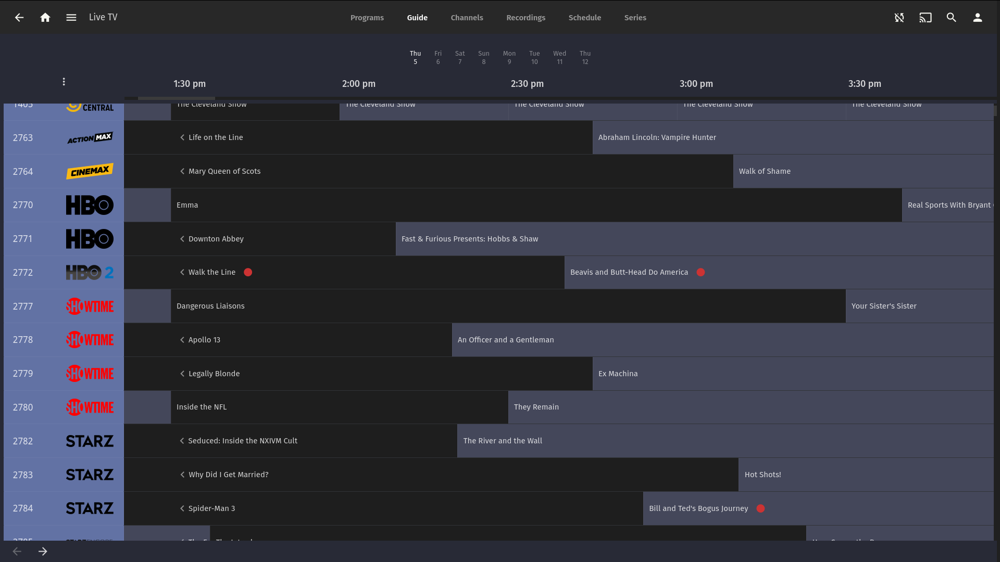
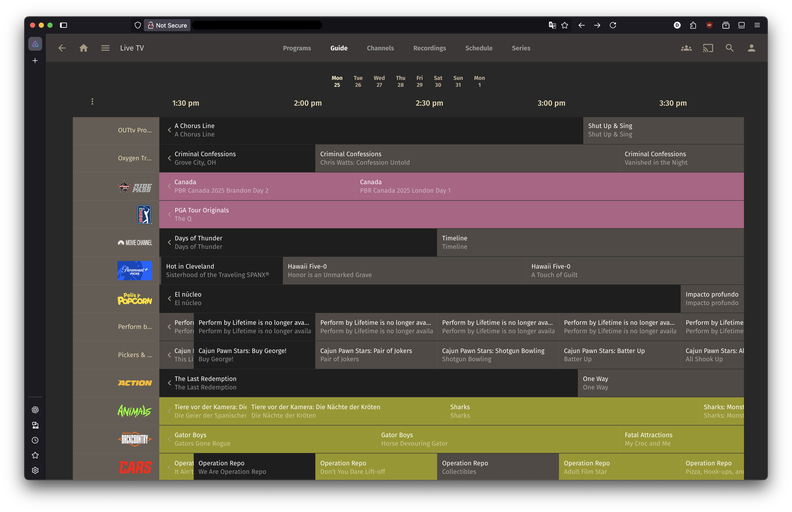
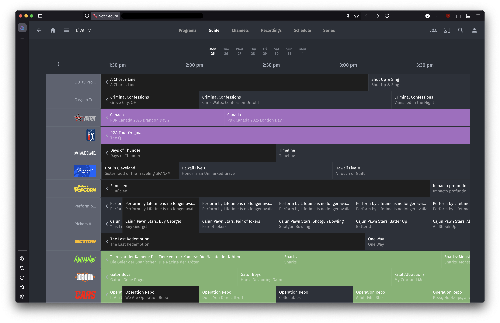
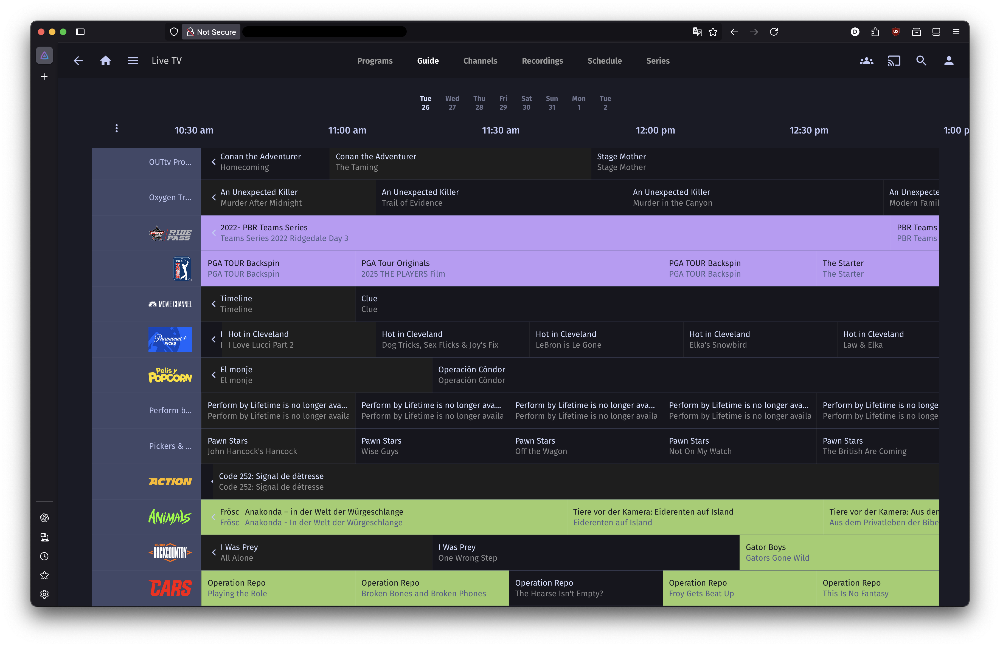

# jellyfin-themes

Jellyfin Themes is a collection of custom CSS stylesheets that instantly transform the look and feel of your Jellyfin web UI. Designed for users who appreciate clean, developer-friendly aesthetics, these themes offer a quick and elegant way to personalize your media server.

---


##  Overview

- **Purpose**: To provide a collection of stylish, custom CSS themes for **Jellyfin**.
- **Target users**: Jellyfin users who want modern, dark aesthetic options with minimal configuration.

---


## Installation & Setup

### Installation

1. Log into your Jellyfin instance.
2. Click your **user avatar** in the top-right corner.
3. Go to **Display** under the **Settings** menu.
4. Scroll to the **Custom CSS code** section.
5. Paste one of the theme import lines:

```css
@import url('https://derektata.github.io/jellyfin-themes/tokyo.css');
```

6. **Scroll down and click Save** — the theme will apply immediately.

---


## Themes

### Dracula


    @import url('https://derektata.github.io/jellyfin-themes/dracula.css')

### Gruvbox Dark


    @import url('https://derektata.github.io/jellyfin-themes/gruvbox-dark.css')

### One Dark


    @import url('https://derektata.github.io/jellyfin-themes/one-dark.css')

### Tokyo


    @import url('https://derektata.github.io/jellyfin-themes/tokyo.css')

---


## Contributing

See [CONTRIBUTING.md](./CONTRIBUTING.md)
